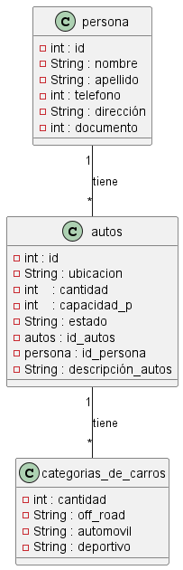

## Necesidad :  se requiere desarrollar  un sistema que permita  almacenar  categoria de carros,autos,auto_persona y persona

#### Requerimientos funcionales

1. RF1  los usuarios deben poder filtrar los autos por categorias como off road, deportivo y automovil

2. RF2  los usuarios deber tener la capacidad  de saber la ubicacion del auto, su estado y la capacidad de personas del auto.

3. RF3  en las  se debe almacenar  el id, nombre, apellido , derecciion, telefono y documento

4. RF4 el auto_persona requiere poder ver  id_auto, id_persona y la descripcion_auto
      
      REF : serequiere la informacion almacenada de categoria_auto
      REF : se requieres la informacion almacenada de auto.


 #### diseñar tablas

CATEGORIAS DE CARROS 
 
| cantidad | off road   |Automóvil  |deportivo |
|----------|------------|-----------|----------|
|     4    |Toyota Hilux|           |          |
|     5    |            |renold clio|          |
|     3    |            |           |maserati  |
|     4    |Toyota txl  |twingo     |porshe panamera|

*en esta categoria podemos  ver la cantidad de carros y sus respectivos nombres. 

---------------------------------------------------------------------------
Autos 

| id     | Ubicación |Capacidad P| Cantidad |  Fecha   | Estado |
|--------|-----------|-----------|----------|----------|--------|
|1100    |NEIVA      |4          |8         |12-07-2016| ACTIVO |
|5102    |CARTAGENA  |2          |9         |17-04-2017| Activo |
| 112    |BOGOTA     |8          |12        |17-04-2018| ACTIVO |
| 90112  |BUCARAMANGA|12         |40        |20-05-2012| ACTIVO |

* se conoce  las caracteristicas de los autos  y de su mismo modo si esta activo o inactivo para su venta.
---------------------------------------------------------------------------

Persona 

| id | nombre        | apellido | telefono | dirección   | documento|
|----|---------------|----------|----------|-------------|----------|
| 1  |    edwar      | alexis   |3224235   |cr11 24 norte| 10838658 |
| 2  |  jose         | herrera  |1234567   | cll 13 15   | 1876356  |
| 3  |  juan         | romero   |1324569   | cr 13 79 sur| 1087365  |

* se conoce la infromacion de los clientes como su direccion y documentos etc.
--------------------------------------------------------------------------------
`Autos_persona`

 id_autos | id_persona | descripción_auto |
----------|------------|------------------|
  1101    |   12020    |deportivo         |
  2522    |   20998    |off road          |
  3525    |   32736    |Automóvil         |

* se debe conocer el id del auto como el de la persona que obtener el auto mas la descripción.
     

     Script de la base de datos
```sql
    DROP DATABASE IF EXISTS parcialA;

    CREATE DATABASE parcialA;

    USE parcialA;

    CREATE table categorias_de_carros (
        cantidad INT NOT NULL PRIMARY KEY AUTO_INCREMENT,
        OF´F road VARCHAR1(150) NOT NULL UNIQUE,
        automovil VARCHAR(150) NOT NULL,
        deportivo VARCHAR(150) NOT NULL
        
    ); 

    CREATE table autos (
        id INT NOT NULL PRIMARY KEY AUTO_INCREMENT,
        ubicacion VARCHAR(150) NOT NULL,
         cantidad DATE NOT NULL,
        capacidad_p INT NOT NULL,
        estado VARCHAR(150) NOT NULL
    ); 

    CREATE table persona (
        id INT NOT NULL PRIMARY KEY AUTO_INCREMENT,
        nombre VARCHAR1(150) NOT NULL UNIQUE,
        apellido VARCHAR(150) NOT NULL,
        telefono INT NOT NULL,
        dirección VARCHAR(150) NOT NULL,
        documento INT NOT NULL
    ); 

    CREATE table Autos_persona  (
        id INT NOT NULL PRIMARY KEY AUTO_INCREMENT,
        FOREIGN KEY (id_autos) REFERENCES autos(id),
        FOREIGN KEY (id_persona) REFERENCES persona(id),
        descripción_auto VARCHAR(150) NOT NULL
        
    ); 
```

[ver](https://trello.com/invite/b/QCcZ23LG/ATTI8a6b479c2aed5a202091e36616fad437AABA0297/videoanalisis)

